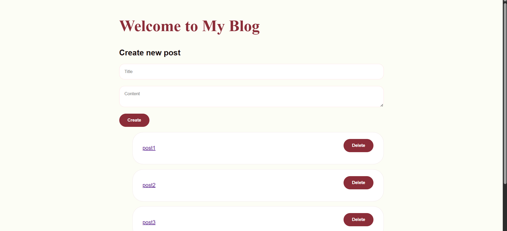

# WordWeave — A Full-Stack Blogging Platform 🩷

Hey there! Im Disha and WordWeave is my first solo fullstack project! WordWeave is a feature-rich full-stack blogging web application built using **Node.js**, **Express**, and **MongoDB**. It features a modern user dashboard, secure multi-user authentication, privacy controls (Public/Private blogs), dynamic search logic, and a fully responsive interface.

---

## 🎨 Project Preview


---

## ✨ Features

### 🔐 Secure Authentication & Session Control
- Secure user signup and login architecture.
- Session-based authorization (`express-session`) protecting sensitive dashboard and editor views.

### ✍️ Comprehensive CRUD Management
- **Create:** Intuitive, distraction-free blog creation form.
- **Read:** Personalized interactive dashboard rendering aggregated feeds dynamically.
- **Update/Delete:** Full ownership-guaranteed management systems allowing users to edit or delete their own posts safely.

### 👁️ Privacy Framework
- Granular control over visibility options (`isPublic: true/false`).
- Public feeds are readable by all authenticated users, while private drafts remain strictly locked within the author's ecosystem.

---

## 💻 Tech Stack

- **Backend Architecture:** Node.js, Express.js
- **Database Layer:** MongoDB, Mongoose (ODM framework)
- **Templating Engine:** Server-Side Rendered (SSR) EJS (Embedded JavaScript)
- **Styling Utility:** Tailwind CSS 

---

## **Installation**

1. Clone the repository

   ```
   git clone https://github.com/dish982/WordWeave.git
   ```

2. Navigate to the project folder

   ```
   cd WordWeave
   ```

3. Install dependencies

   ```
   npm install
   ```

4. Environment Variables Configuration

   ```
   port=your_port_number
   mongodb_uri=your_mongodb_connection_string
   session_key=your_custom_key
   ```
   
4. Build Optimized Production Styles (Tailwind)

   ```
   npm run build:css
   ```

4. Start the server

   ```
   node app.js
   ```

   or

   ```
   npm start
   ```

5. Open in browser

   ```
   http://localhost:your_port_number
   ```
   
## **Preview**



This project is for educational and portfolio purposes only.

## Author
Made with ❤️ by [Disha](https://github.com/dish982)

