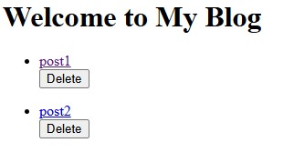

# ** File based blogging system**

A simple blogging platform built with **Node.js**, **Express**, and **EJS** that allows users to create, edit, and delete blog posts. The project demonstrates CRUD operations, routing, and basic templating for a server-side rendered application.

## **Features**

- Create new blog posts
- View all posts
- Edit existing posts
- Delete posts
- Organized routes and views
- Modular structure with Express Router

## **Tech Stack**

* **Backend:** Node.js, Express.js
* **Templating Engine:** EJS

## **Installation**

1. Clone the repository

   ```
   git clone https://github.com/dish982/file-based-blogging-system.git
   ```

2. Navigate to the project folder

   ```
   cd file-based-blogging-system
   ```

3. Install dependencies

   ```
   npm install
   ```

4. Start the server

   ```
   node app.js
   ```

   or

   ```
   npm start
   ```

5. Open in browser

   ```
   http://localhost:3000
   ```
   
## **Preview**

<br>


This project is for educational and portfolio purposes only.

## Author
Made with ❤️ by [Disha](https://github.com/dish982)
